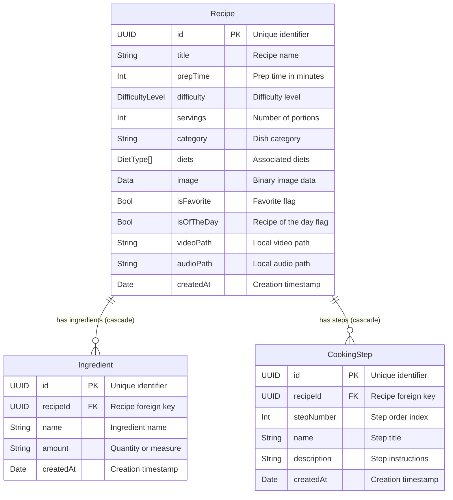

# Cookbook

## Database schema (SwiftData)

```mermaid
erDiagram
    Recipe {
        UUID id PK "Unique identifier"
        String title "Recipe name"
        Int prepTime "Prep time in minutes"
        DifficultyLevel difficulty "Difficulty level"
        Int servings "Number of portions"
        String category "Dish category"
        DietType[] diets "Associated diets"
        Data image "Binary image data"
        Bool isFavorite "Favorite flag"
        Bool isOfTheDay "Recipe of the day flag"
        String videoPath "Local video path"
        String audioPath "Local audio path"
        Date createdAt "Creation timestamp"
    }

    Ingredient {
        UUID id PK "Unique identifier"
        UUID recipeId FK "Recipe foreign key"
        String name "Ingredient name"
        String amount "Quantity or measure"
        Date createdAt "Creation timestamp"
    }

    CookingStep {
       UUID id PK "Unique identifier"
        UUID recipeId FK "Recipe foreign key"
        Int stepNumber "Step order index"
        String name "Step title"
        String description "Step instructions"
        Date createdAt "Creation timestamp"
    }

    Recipe ||--o{ Ingredient : "has ingredients (cascade)"
    Recipe ||--o{ CookingStep : "has steps (cascade)"
```
