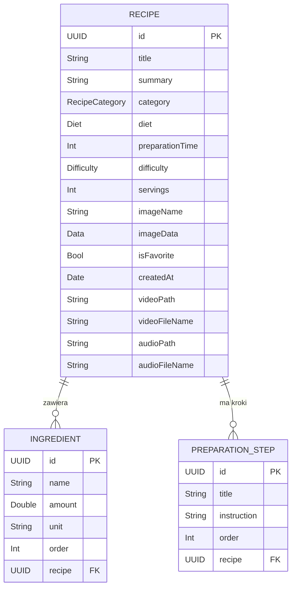

# Cookbook

## Schemat bazy danych

Dane przepisów są przechowywane lokalnie przez `SwiftData`. Usunięcie przepisu usuwa również powiązane składniki i kroki przygotowania.

```mermaid
erDiagram
    RECIPE ||--o{ INGREDIENT : "zawiera"
    RECIPE ||--o{ PREPARATION_STEP : "ma kroki"

    RECIPE {
        UUID id PK
        String title
        String summary
        RecipeCategory category
        Diet diet
        Int preparationTime
        Difficulty difficulty
        Int servings
        String imageName
        Data imageData
        Bool isFavorite
        Date createdAt
        String videoPath
        String videoFileName
        String audioPath
        String audioFileName
    }

    INGREDIENT {
        UUID id PK
        String name
        Double amount
        String unit
        Int order
        UUID recipe FK
    }

    PREPARATION_STEP {
        UUID id PK
        String title
        String instruction
        Int order
        UUID recipe FK
    }
```
